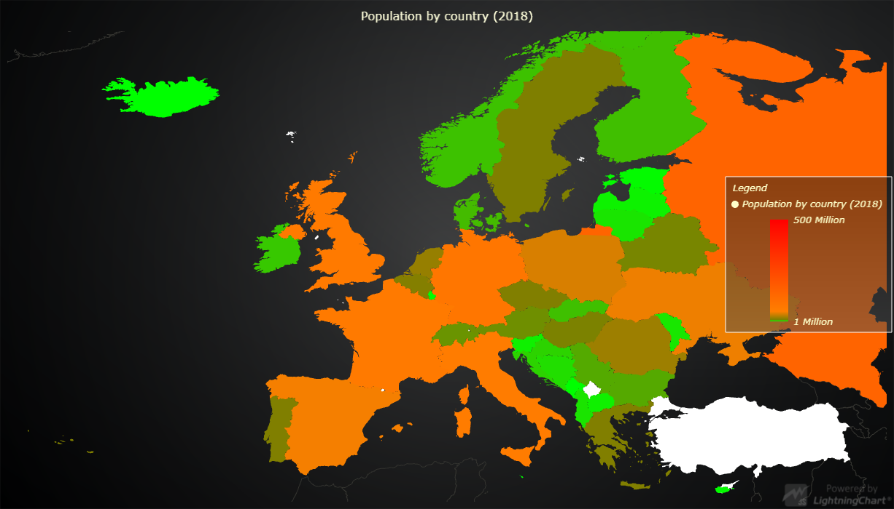

# Map Chart Dynamic Coloring



This demo application belongs to the set of examples for LightningChart JS, data visualization library for JavaScript.

LightningChart JS is entirely GPU accelerated and performance optimized charting library for presenting massive amounts of data. It offers an easy way of creating sophisticated and interactive charts and adding them to your website or web application.

The demo can be used as an example or a seed project. Local execution requires the following steps:

- Make sure that relevant version of [Node.js](https://nodejs.org/en/download/) is installed
- Open the project folder in a terminal:

        npm install              # fetches dependencies
        npm start                # builds an application and starts the development server

- The application is available at *http://localhost:8080* in your browser, webpack-dev-server provides hot reload functionality.


## Description

Example on using `MapChart` with real data set for coloring map regions dynamically.

The data set is downloaded with `fetch` when the application is started.
It contains population for each country around European area in the year 2018.

```js
[
  { "Country Code": "ALB", Value: 2866376 },
  { "Country Code": "AUT", Value: 8840521 },
  { "Country Code": "BLR", Value: 9483499 },
];
```

The application translates this format to one expected by `MapChart`:

```js
const regionValuesData = populationData.map((item) => ({
  ISO_A3: item["Country Code"],
  value: item["Value"],
}));
```

```js
[
  { ISO_A3: "ALB", value: 2866376 },
  { ISO_A3: "AUT", value: 8840521 },
  { ISO_A3: "BLR", value: 9483499 },
];
```

Finally, the data is supplied to `MapChart` using the `invalidateRegionValues` method:

```js
mapChart.invalidateRegionValues(regionValuesData);
```

`MapChart` can utilize the region values data in two ways:

1. Dynamic region coloring based on color look-up table.
2. Auto Cursor formatting.

### Dynamic region coloring

Dynamic coloring is enabled by setting the regions _fill style_ to a `PalettedFill`:

```js
mapChart.setFillStyle(
  new PalettedFill({
    lut: new LUT({
      steps: [
        {
          value: 1 * 1000 * 1000,
          color: ColorRGBA(0, 255, 0),
          label: "1 Million",
        },
        { value: 10 * 1000 * 1000, color: ColorRGBA(127, 127, 0), label: "" },
        { value: 50 * 1000 * 1000, color: ColorRGBA(255, 127, 0), label: "" },
        {
          value: 500 * 1000 * 1000,
          color: ColorRGBA(255, 0, 0),
          label: "500 Million",
        },
      ],
      interpolate: true,
      // This property is used to specify fallback color for regions which have no data.
      color: ColorRGBA(255, 255, 255),
    }),
  })
);
```

### Auto cursor formatting

`MapChart` cursor formatting is configured with `setCursorResultTableFormatter` method:

```js
mapChart.setCursorResultTableFormatter(
  (builder, region, value, longitude, latitude) => {
    builder.addRow(region.name);

    // Region value is supplied to the formatter function. Note, that it is `undefined` for regions which were not invalidated by the user.
    if (value) {
      builder.addRow(
        `Population: `,
        "",
        `${(value / (1000 * 1000)).toFixed(1)} million`
      );
    } else {
      builder.addRow(`No population data available`);
    }
    return builder;
  }
);
```


## API Links

* [Map chart]
* [Map types]
* [Paletted fill]
* [Color lookup table]
* [Color RGBA]
* [Empty line]
* [Format longitude/latitude]


## Support

If you notice an error in the example code, please open an issue on [GitHub][0] repository of the entire example.

Official [API documentation][1] can be found on [Arction][2] website.

If the docs and other materials do not solve your problem as well as implementation help is needed, ask on [StackOverflow][3] (tagged lightningchart).

If you think you found a bug in the LightningChart JavaScript library, please contact support@arction.com.

Direct developer email support can be purchased through a [Support Plan][4] or by contacting sales@arction.com.

[0]: https://github.com/Arction/
[1]: https://www.arction.com/lightningchart-js-api-documentation/
[2]: https://www.arction.com
[3]: https://stackoverflow.com/questions/tagged/lightningchart
[4]: https://www.arction.com/support-services/

© Arction Ltd 2009-2020. All rights reserved.


[Map chart]: https://www.arction.com/lightningchart-js-api-documentation/v3.1.0/classes/mapchart.html
[Map types]: https://www.arction.com/lightningchart-js-api-documentation/v3.1.0/globals.html#maptypes
[Paletted fill]: https://www.arction.com/lightningchart-js-api-documentation/v3.1.0/classes/palettedfill.html
[Color lookup table]: https://www.arction.com/lightningchart-js-api-documentation/v3.1.0/classes/lut.html
[Color RGBA]: https://www.arction.com/lightningchart-js-api-documentation/v3.1.0/globals.html#colorrgba
[Empty line]: https://www.arction.com/lightningchart-js-api-documentation/v3.1.0/globals.html#emptyline
[Format longitude/latitude]: https://www.arction.com/lightningchart-js-api-documentation/v3.1.0/globals.html#formatlongitudelatitude

